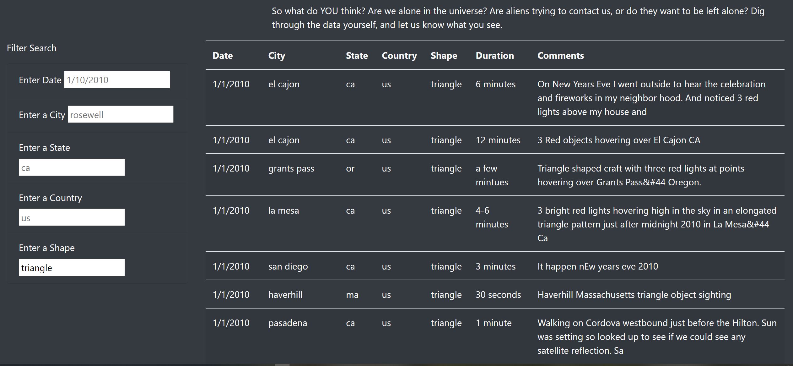

# UFOs Sightings on Multiple Criteria

## Overview of Project

### purpose

To provide users with more search options to filter through the UFOs data table at the same and retrieve specific information.

## Results

Users can search by shape as shown below. For example, a user can type "triangle" and it will pull up the data that meet the search criteria

## Summary

The page does not load data