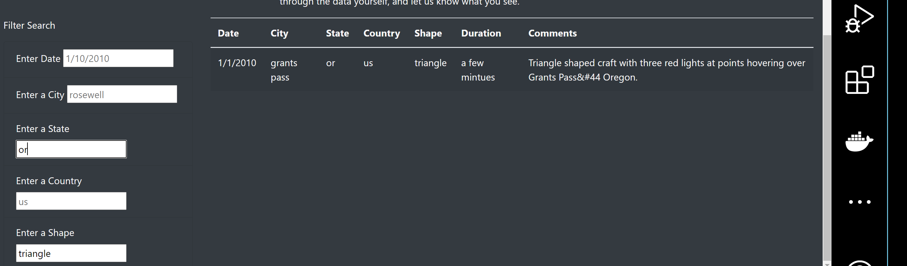

# UFOs Sightings on Multiple Criteria

## Overview of Project

### purpose

To provide users with more search options to filter through the UFOs data table at the same and retrieve specific information.

## Results

Users can search by shape as shown below. For example, a user can type "triangle" and it will pull up the data that meet the search criteria

Users can also try search multiple fields. For example, a user can try to filter base on a combination of shape and state or city as shown below.

## Summary

One drawback to this page is that the page can only filters base on the information it is built upon. It does not allow to filter for any other years other than, year = 2010, for example else no search result will be return.

I would suggest instead of building the page with limited data, connect it to an online database that get updated frequently. This way, users can filter any data they want for any location at any given period.
